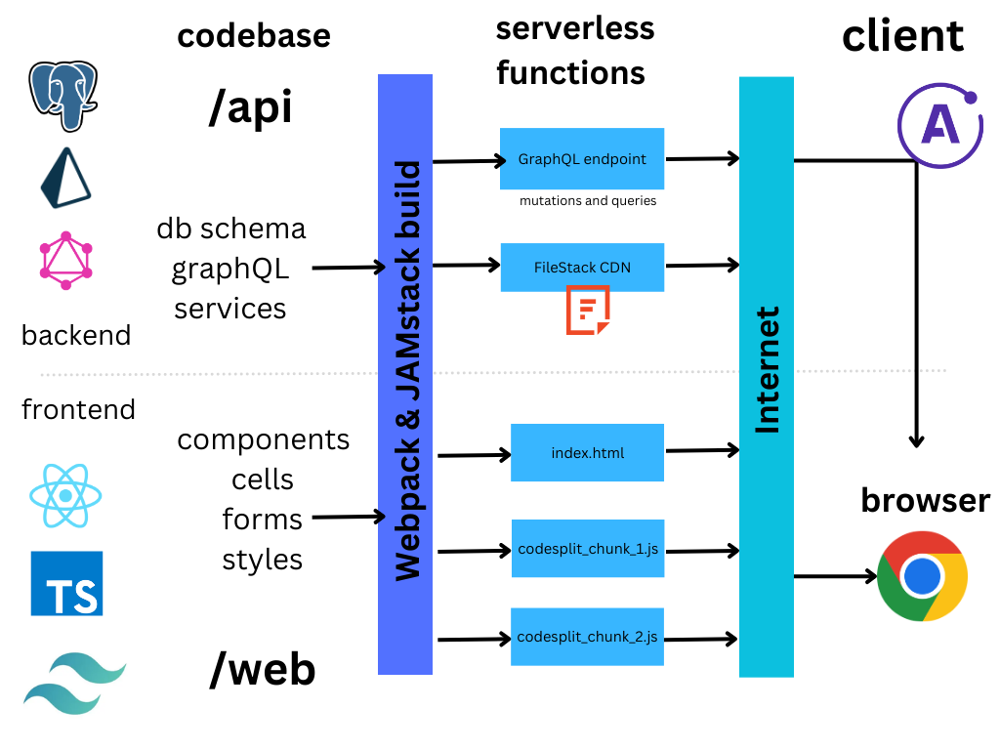

# Redwood-Dropbox

Welcome to Redwood-Dropbox!</br>
We ❤️ [RedwoodJS](https://redwoodjs.com)


## Live Demo

[https://redwoodjs-dropbox.vercel.app](https://redwoodjs-dropbox.vercel.app)

## Using locally

> **Prerequisites**
>
> - Redwood requires [Node.js](https://nodejs.org/en/) (>=14.19.x <=16.x) and [Yarn](https://yarnpkg.com/) (>=1.15)
> - Are you on Windows? For best results, follow our [Windows development setup](https://redwoodjs.com/docs/how-to/windows-development-setup) guide

Start by installing dependencies:

```
yarn install or npm run install
```

Then change into that directory and start the development server:

```
cd my-redwood-project
yarn redwood dev
```

Your browser should automatically open to http://localhost:8910 where you'll see the Initial Page of the App.

Redwood uses [Prisma](https://www.prisma.io/), a next-gen Node.js and TypeScript ORM, to talk to the database.

>Note:
 *Temporarily*, I am using my own credentials for the live demo as proof of concept. However, if you plan on developing this project locally, you must update the values for DATABASE_URL, REDWOOD_ENV_FILESTACK_API_KEY, REDWOOD_ENV_FILESTACK_SECRET, and TEST_DATABASE_URL in the .env file that should be located in the root directory of the repository
